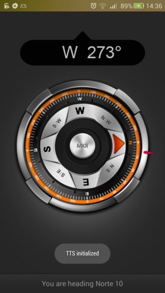
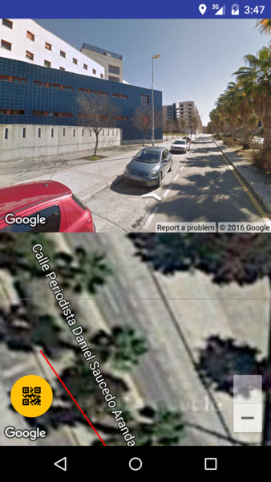
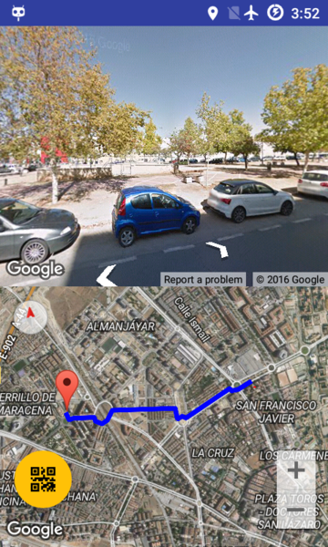
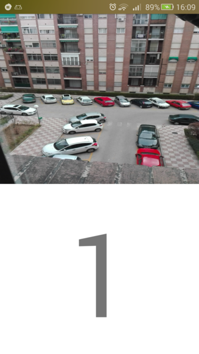
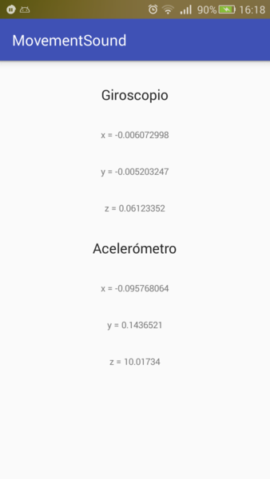

# Tutoriales de las aplicaciones Android

## BrujulaCompass

Para realizar esta aplicación se ha tomado como base la brújula de la _ROM_ MIUI. Se le ha añadido el reconocimiento de voz (_ASR_) y se modificó la la interfaz de la brújula para que mostrara hacia donde tiene que dirigirse el usuario en función del comando de voz. Veamos la primera pantalla:

### Inicio de la aplicación

Al mostrarse esta pantalla, el usuario debe proporcionar un comando de voz, por ejemplo _“Norte 10”_. Tras dar el comando, en la brujula se añadirá un marcador indicando dónde está el Norte + 10 grados. Además de esto, mediante una voz, se le irá indicando al usuario si debe girar a la derecha/izquierda o va en la dirección correcta:

Como vemos en la imagen, aparece un indicador rojo situado en el norte + 10 grados. Veamos otro ejemplo, Norte 45:

Para dar nuevas instrucciones de voz basta con tocar la brújula.

En la parte inferior de la pantalla, aparece el comando de voz reconocido.

## GPSQR

En esta aplicación se lee un destino mediante códigos QR, tras esto, se puede iniciar la navegación con _Google Maps_. En la aplicación se muestran dos mapas. En el de abajo aparece el destino al que debemos llegar, además, se va dibujando un camino por el que el usuario va pasando. En el mapa de arriba se ve el mapa desde el punto de vista _StreetView_. Veamos la aplicación:

El _Floating Action Button_ de abajo a la izquierda lanza el lector de QRs, que usa una simplificación de la librería _Zxing_. Cuando se escanea una localización, veremos lo siguiente:

Una vez leido el QR, solo resta pulsar el marcador rojo para iniciar la navegación con _Google Maps_. La ruta calculada por la _API_ de _Google_ es la azul, mientras que la ruta real tomada por el usuario aparecerá en rojo.

<!--Fotos de la ruta-->

## Photo Gesture

Para realizar esta aplicación se ha usado una librería llamada [PatterLock](https://github.com/DreaminginCodeZH/PatternLock).

En esta aplicación se le pide al usuario que establezca un patrón de bloqueo, puede ser tan complejo como el patrón de bloqueo usado en Android. Una vez establecido, cuando se introduzca correctamente la aplicación tomará una foto a los 3 segundos. A continuación mostramos la pantalla principal de la aplicación.

Al pulsar _“Establecer patrón”_ veremos lo siguiente:

Es posible hacer que el patrón no sea visible cuando lo introducimos, para añadir una capa extra de seguridad.

Cuando pulsemos _Establecer patrón_ se nos pedirá que lo dibujemos dos veces, para confirmarlo:

Hecho esto, cuando volvamos a la pantalla principal, en lugar de “Establecer patrón” aparecerá “Echar foto”. Si pulsamos sobre ese botón, se nos pide el patrón establecido. Si se introduce bien, aparecerá la cámara con una cuenta atrás, al llegar a 0 se echará una foto:

La foto se guardará en la galería.

## Movement Sound

En esta aplicación se usa el acelerómetro y el giroscopio, para mostrar sus valores por pantalla. El giroscopio es capaz de detectar una rotación del dispositivo, al hacerlo, reproduce un sonido. Por contra, el acelerómetro detecta una sacudida del dispositivo y reproduce un sonido distinto.

